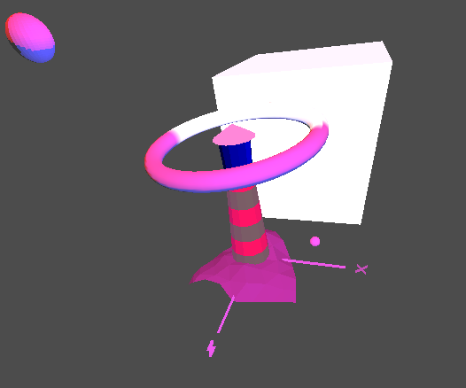

The spotlight is moving and attached to the lighthouse top.
The torus is smooth and moving.
The glass of the lighthouse has a value of 100 for the shininess.
The other spheres represent the point lights, of blue and red.
All lights are turned on in this picture.
My video can be found here: http://web.engr.oregonstate.edu/~shephern/cs450/assign4.mp4.
