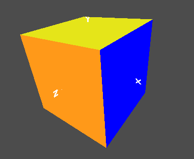
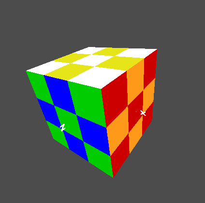
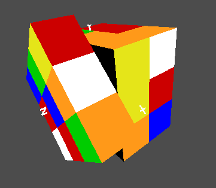
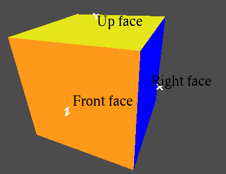
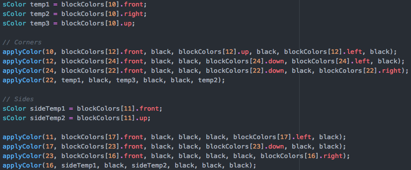

{ width=350px }

## Video Demonstration
The video can be found here: [http://web.engr.oregonstate.edu/~shephern/cs450/final_video.mp4](http://web.engr.oregonstate.edu/~shephern/cs450/final_video.mp4).

## Proposal

My plan is to create a representation of a 3x3 rubic cube. This will be made up of 26 outer cubes, with appropriately colored sides. I will link the following keys to provide user interaction:

 - r: Right face ‘rotate clockwise’
 - l: Left face ‘rotate clockwise’
 - u: Up face ‘rotate clockwise’
 - d: Down face ‘rotate clockwise’
 - f: Front face ‘rotate clockwise’
 - b: Back face ‘rotate clockwise’
 - m: Middle face ‘rotate clockwise’ in relation to right face
 - e: Equator face ‘rotate clockwise’ in relation to top face
 - s: Standing face ‘rotate clockwise’ in relation to front face

These keys can be modded with shift to rotate the face counter clockwise. My program will complete the animation, and then allow for more input. The scene will be rotatable also, with the faces clearly labeled and assigned at the start of the program. An additional feature will be a randomized scramble, which will animate to scramble the cube.
Challenges in this project will include rotating the cubes around different axis, as well as switching their association, with their macro face. For instance, as a side is rotated upward, the lower subcubes will associate with the top face and the front face.

## Completed Project

For my project I made a 3x3x3 rubic cube.

The cube starts out as a solved cube, and using the keys as described above, you are able to manipulate the cube, as you would with a real cube.
The cube is made up of 26 subcubes, or blocks.
The keys refer to the 18 possible moves of a rubic cube and will cause the graphic to animate out that move.
While the graphic is animating, no animations are considered.
Once the animation is done, then another animation can start.

Additionally they cube has the added feature of randomization and reseting.
With randomizing I run the cube through 20 random moves, and reseting simply sets back the initial colors.

{ width=250px }

{ width=250px }

As mentioned in the proposal, the keys are locked to the initial orientation, so as you change the view the buttons do not update.
In other words, the front face is static, no matter how you rotate the scene.
To reduce the confusion I added the option to display labels to clearly show the faces.

{ width=250px }

## Changes to Proposal

The main change I made to the proposal was how the underlying cube manipulation happened.
Originally I had planned to associate each subcube with a face and change its associations once it was moved.
This proved to be more challenging, as I realized it would require some tricky rotation calculation, as each cube would be rotated over the center multiple times.
The method I developed was simpler, but didn't allow for the animation of the randomization, so although it still can be randomized, the random moves aren't animated.
Otherwise my changes do not affect the end result.

## Cleverness and Conclusion

I think my major breakthrough moment in this project was deciding to separate the animation and the colors.
At first I was struggling with persistent animations and how to rotate a side, then rotate the top or something.
There was no way I could think of without keeping multiple different rotation buffers as variables and changing them with every rotation.
This would require adding rotations to reduce animations while keeping track of previous rotations.

My solution was to separate animations and colors, so that there is only ever one rotation on a subcube at one time.
This means that the rotations are simple, just x, y, or z axis rotations of 90 degrees and in the same instant the animation is done the colors rotate.
This has the exact effect of the other method, but has the benefit of being much simpler to conceptualize and implement.

Once this was solved, the majority of the work was entering each rotation in regards to the colors of all the cubes involved.

From this project, I've learned about using arrays and structs to hold settings.
I used arrays of structs to hold information about each subcube, like rotation, position, and face colors.
This made it really easy to reference any of the blocks and select their front face color for instance.
It also made it easy to rotate all the cubes by just changing the rotation for all of the desired indexes.
I also used switch statements extensively, which isn't something I'd really done before, or at least not to this scale.
With 9 different possible moves, it was convenient to have a switch statement select the color changing function or animation.
I also spent a good amount of time learning more about the animation method, as I needed to alter to be synced to button pressing and to end after the animation was complete.
Otherwise I used many methods that we learned earlier, but to a larger scale.
I am really proud of this rubic cube, and although I won't be making any record times on it, the project was a great learning experience.
